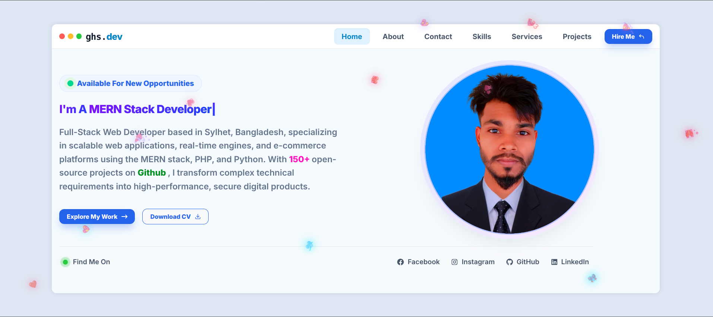
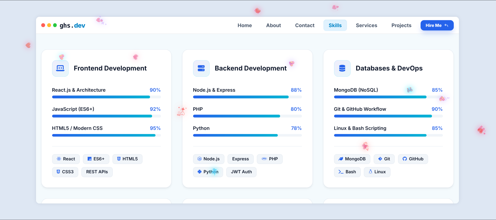

# 🚀 Ghs Julian - Developer Portfolio & Showcase

<br/><br/>


---

### 💻 Full Stack & MERN Stack Web Developer

**Ghs Julian Portfolio** - A modern, high-performance web portfolio engineered to showcase real-world client solutions, full-stack web applications, open-source work, and scalable MERN stack projects.

Built with performance, SEO, and responsiveness at its core, this application provides an interactive experience for potential clients, employers, and collaborators to explore my professional capabilities, technical stack, and overall engineering workflow.

Built using modern web standards, modular UI architecture, and production-ready code practices tailored for commercial and freelance environments.

---

### ℹ️ Repository Information

[](https://github.com/ghsjulian)

[](https://github.com/ghsjulian)

[](https://github.com/ghsjulian)

[](https://github.com/ghsjulian)

[](https://github.com/ghsjulian)

[](LICENSE)

---

### 👩‍💻 Developer & Designer

**Name :** Ghs Julian (Gobindo Bhor)

**Location :** Kamalganj, Moulvibazar, Sylhet Division, Bangladesh

**Phone/WhatsApp :** +8801302661227

**Email :** ghsjulian@outlook.com

**Personal Portfolio :** https://ghsresume.netlify.app

**GitHub Profile :** https://github.com/ghsjulian

**Facebook Profile :** https://facebook.com/ghs.julian.85

---

### 🌍 Live Demos & Links

🚀 Main Portfolio Website
https://ghsresume.netlify.app

📂 GitHub Organization & Projects
https://github.com/ghsjulian

📧 Contact & Direct Inquiry
mailto:ghsjulian@outlook.com

---

### ✨ Key Features

Core Experience & UI

- Modern Cyberpunk & Modern Web Aesthetics
- Ultra-Fast Responsive Design (Mobile-First Workflow)
- Interactive Project Showcase with Live Demos & Code Links
- Seamless Navigation & Fluid Animations
- Integrated SEO Optimization & Schema Structured Data
- Downloadable Resume / CV Integration

---

Services Offered

- Full Stack MERN Development (MongoDB, Express, React, Node.js)
- Custom E-Commerce & Management Dashboards
- Web Application Architecture & REST API Design
- UI/UX Engineering & Mobile Responsiveness
- PHP & Python Scripting Solutions
- Bug Fixing, Refactoring & Deployment Assistance

---

Client & Lead Management

- Direct Contact Form with Automatic Mail Notifications
- Integrated Social & Professional Media Links
- Interactive Service Packages & Pricing Estimates
- Live Project Previews with Multi-Device Compatibility
- WhatsApp Direct Inquiry Integration

---

Technical & Performance Highlights

- Lightning Fast Load Times & Asset Optimization
- Dynamic Project Filtering by Technology & Category
- Dark / Modern High-Contrast Theming
- Cross-Browser & Cross-Platform Compatibility
- Clean, Maintainable, and Scalable Source Code

---

### 🏗 Technology Stack

Frontend

- React.js
- HTML5
- CSS3 / SCSS
- JavaScript (ES6+)
- Tailwind CSS / Custom CSS Components
- Lucide / React Icons
- Framer Motion / Custom Animations
- Axios

Backend & APIs

- Node.js
- Express.js
- RESTful APIs
- JSON-LD Structured Data
- Nodemailer

Database & Deployment

- MongoDB Atlas / Local MongoDB
- Netlify / Vercel
- Git / GitHub Version Control

Development Environment

- Linux / Termux Android Setup
- VS Code
- Postman
- npm / yarn

---

### 📂 Project Structure

```bash
ghs-cv-8.26/

├── public/
│   ├── favicon.svg
│   ├── og-image.jpg
│   └── robots.txt
│
├── src/
│   ├── assets/
│   │   ├── images/
│   │   └── icons/
│   ├── components/
│   │   ├── Navbar.jsx
│   │   ├── Hero.jsx
│   │   ├── About.jsx
│   │   ├── Skills.jsx
│   │   ├── Projects.jsx
│   │   ├── Services.jsx
│   │   └── Contact.jsx
│   ├── data/
│   │   └── projectsData.js
│   ├── styles/
│   ├── utils/
│   ├── App.jsx
│   └── main.jsx
│
├── index.html
├── package.json
├── README.md
└── .env
```

---

### ⚡ Core Technologies

| Frontend              | Backend & Tools          |
| :-------------------- | :----------------------- |
| **React.js**          | **Node.js**              |
| **HTML5 / CSS3**      | **Express.js**           |
| **JavaScript (ES6+)** | **MongoDB / Mongoose**   |
| **Tailwind CSS**      | **REST APIs / Axios**    |
| **Git / GitHub**      | **Termux / Android Dev** |

---

### 💻 Languages & Frameworks

- **JavaScript (ES6+)**
- **HTML5 & CSS3**
- **React.js**
- **Node.js & Express.js**
- **PHP**
- **Python**
- **Bash / Shell Scripting**

---

### 📦 Major Packages

- `react`
- `react-dom`
- `react-router-dom`
- `react-icons`
- `lucide-react`
- `axios`
- `express`
- `dotenv`
- `nodemailer`

---

### 🙏 Thank You

Thank you for visiting my personal developer portfolio!

Whether you are looking to hire a **Full Stack Web Developer**, collaborate on a project, or offer feedback, your interest and support are greatly appreciated. Every star ⭐ on my repositories fuels my continuous learning and growth.

If you like my work or find any project helpful, please consider:

- ⭐ **Star** this repository
- 🍴 **Fork** and explore the code
- 💼 **Reach out** for freelance contracts or direct hiring
- 🤝 **Connect** on GitHub and social media

Together, let's build better software and bring innovative ideas to life.

---

### 📜 License

This project is licensed under the **MIT License**.

You are free to view, adapt, and build upon this project for your own development needs.

---

<div align="left">

**Keep Learning • Keep Building • Keep Growing**

🙏🌸 Radhe Radhe 🌸🙏

_May your code compile successfully and your ideas become reality._

⭐ Have a wonderful day!

</div>
